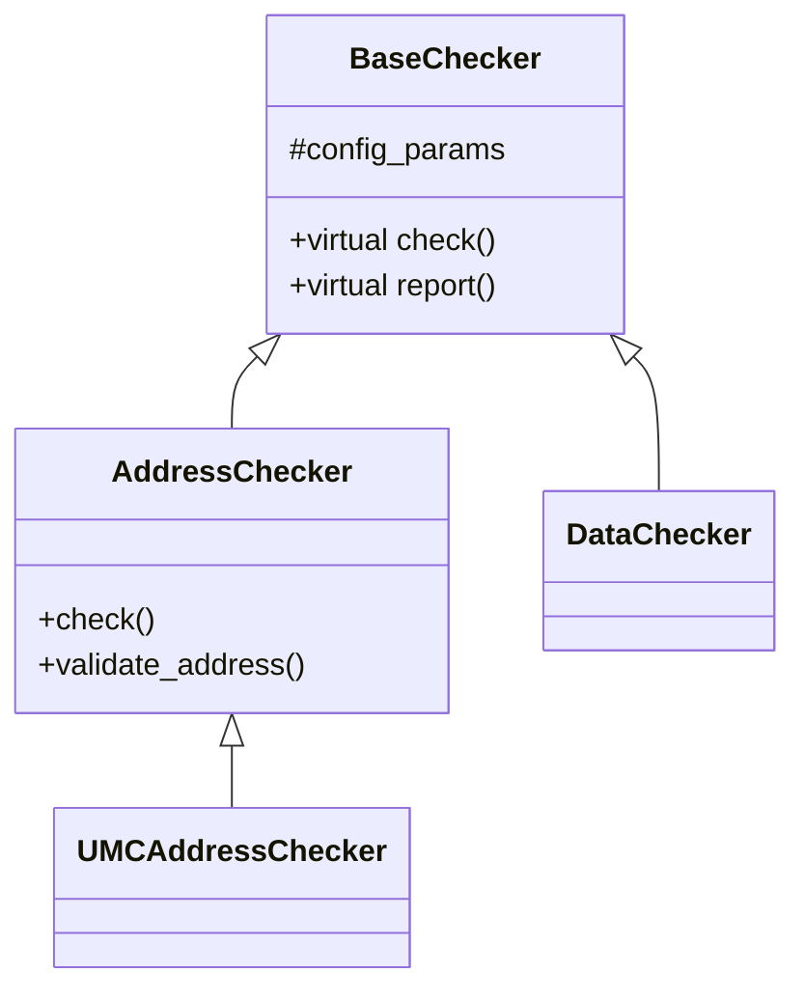

# Testplan Skill

Create comprehensive verification testplans for new features by systematically tracing them through the codebase.

## Trigger
`/testplan`

## Overview

This skill helps you create comprehensive testplans for new features by systematically tracing the feature through the entire codebase.

**MANDATORY FIRST STEP:**
- **ALWAYS read this TESTPLAN_GUIDE.md file FIRST** before proceeding with any testplan creation task
- This applies regardless of what prompt is given
- Read the entire guide to understand the methodology, workflow, and requirements

**CLEANUP REQUIREMENT:**
- **Delete any backup files created during the process** after you are done
- This includes temporary files, backup copies, and intermediate artifacts
- Keep only the final deliverables (testplan markdown, HTML preview)

**Important:** This guide provides the methodology and workflow. The actual testplan template will be provided by the user (typically from Confluence) when requesting a testplan.

**Critical Requirements:**
1. **Generate diagrams and figures** - Use ASCII art, Mermaid, or other formats to visualize architecture, flows, and hierarchies
2. **Deeply investigate base classes** - Understand and document complete inheritance chains and inherited functionality
3. **Create visual documentation** - Diagrams are mandatory for transaction flows, class hierarchies, state machines, and verification architecture

---

## Part 1: Feature Tracing Methodology

Before writing the testplan, you must understand the complete feature flow from transaction start to end.

### Step 1: Identify the Feature Entry Points
- Locate where the feature transaction begins (e.g., interface signals, configuration registers, command inputs)
- Identify all files that handle the initial feature trigger
- Document the starting conditions and signals

### Step 2: Trace Through the Data Path
- Follow the transaction through each processing stage
- Identify all modules/files involved in the feature
- Map out data transformations at each stage
- Note any conditional paths or branches in the flow

### Step 3: Identify Control Logic
- Find all configuration registers/parameters that affect the feature
- Locate enable/disable mechanisms
- Identify mode selections and their impact
- Document chicken bits and their effects

### Step 4: Find Checkers and Monitors
- Locate existing checkers related to the feature
- Identify monitoring points in the transaction flow
- Find assertion files that validate the feature
- Document coverage points already in place

### Step 5: Trace to Transaction Completion
- Identify where the transaction completes
- Find output signals and their destinations
- Document success/error conditions
- Map completion handshakes and acknowledgments

### Step 6: Identify Dependencies
- Find interfaces with other blocks
- Document timing dependencies
- Identify resource sharing or arbitration
- Note any SOC-level integration points

---

## Part 2: Instructions for AI-Assisted Testplan Creation

### Important Notes

**About the Template:**
- **Default Template:** https://amd.atlassian.net/wiki/spaces/UMCCSSE/pages/557602231/Testplan+Template
- **ALWAYS ask the user** if they want to use the default template or provide a different one
- Read the template using `mcp__atlassian__confluence_get_page` before starting

**About HTML Preview:**
- The HTML preview (`testplan_preview.html`) should contain the **FINAL testplan** you create for the specific feature
- It should NOT contain this guide (TESTPLAN_GUIDE.md)
- The preview is what will eventually be pushed to Confluence, so it should be ready for review

**About Diagrams and Documentation:**
- **ALWAYS generate diagrams and figures whenever possible**
- **DEEPLY investigate base classes** to understand complete functionality
- Include class hierarchies, transaction flows, state machines, and architectural diagrams
- Base class analysis is critical for understanding the full feature implementation

### Workflow

When asked to create a testplan for a feature:

1. **Confirm Template to Use**
   - **ALWAYS ask first:** "Do you want to use the default testplan template, or do you have a different template?"
   - **Default template:** https://amd.atlassian.net/wiki/spaces/UMCCSSE/pages/557602231/Testplan+Template
   - Wait for user response before proceeding
   - If user says "default" or "yes" or similar → use the default template
   - If user provides a different Confluence link → use that template
   - Read the specified template using `mcp__atlassian__confluence_get_page` with the page ID from the URL

   **Example interaction:**
   ```
   AI: "Do you want to use the default testplan template (https://amd.atlassian.net/wiki/spaces/UMCCSSE/pages/557602231/Testplan+Template), or do you have a different template you'd like to provide?"

   User: "Use the default" → AI reads page ID 557602231
   OR
   User: "Use this: https://amd.atlassian.net/wiki/spaces/X/pages/123456/My_Template" → AI reads page ID 123456
   ```

2. **Get Feature Details**
   - Ask for feature name and basic description
   - Request any specification documents or references
   - Identify the starting point (file/module in the codebase)

3. **Perform Feature Tracing**
   - Use Glob/Grep to find all related files
   - Read through the transaction flow systematically
   - Build a complete map of the feature path
   - Document all files and their roles
   - **IMPORTANT:** Deeply analyze base classes and inheritance hierarchies
     - Look into parent classes to understand full functionality
     - Document class relationships and inheritance chains
     - Identify virtual/abstract methods and their implementations
     - Trace method calls through the inheritance tree

4. **Analyze Existing Infrastructure**
   - Find related checkers and monitors
   - Identify reusable verification components
   - Locate existing coverage models

5. **Fill Out Template**
   - Complete all sections based on the analysis
   - Provide specific file references with line numbers
   - Include actual signal names and module names
   - Create concrete test scenarios
   - **CRITICAL:** Generate diagrams and figures whenever possible
     - Create architecture diagrams showing feature flow
     - Draw class hierarchy diagrams (especially for base classes)
     - Generate sequence diagrams for transaction flows
     - Include state machine diagrams if applicable
     - Show data path diagrams with transformations
     - Illustrate checker/monitor placement in the architecture
     - Use ASCII art, Mermaid syntax, or reference diagram files
     - Document base class relationships and inheritance structures

6. **Review for Completeness**
   - Ensure all transaction stages are covered
   - Verify all configurations are documented
   - Check that coverage addresses all scenarios
   - Validate that dependencies are identified

7. **Generate Deliverables**
   - Create the testplan markdown file (e.g., `testplan_<feature_name>.md`)
   - **Include diagrams in the testplan:**
     - Architecture/block diagram showing feature components
     - Class hierarchy showing base classes and inheritance
     - Transaction flow diagram from start to end
     - State machine diagram (if applicable)
     - Verification architecture showing checker/monitor placement
   - Document all base class functionality discovered during investigation
   - Suggest specific checker implementations
   - Propose stimulus enhancements
   - Define coverage scenarios

8. **Create HTML Preview for User Review**
   - Convert the **generated testplan** (NOT this guide) to HTML
   - Create the HTML file: `testplan_preview.html`
   - Use a markdown to HTML conversion approach (Python-based)
   - The HTML should contain ONLY the final testplan content that will be pushed to Confluence
   - Launch Firefox in background mode: `firefox testplan_preview.html &`
   - **IMPORTANT:** Firefox is for preview purposes only - to allow user review of the formatted testplan before pushing to Confluence
   - Include CSS styling for better readability (tables, headings, code blocks, etc.)

9. **Cleanup**
   - Delete any backup files created during the process
   - Remove temporary files, scripts, or intermediate artifacts
   - Keep only the final deliverables:
     - `testplan_<feature_name>.md` (the final testplan)
     - `testplan_preview.html` (the HTML preview)

### HTML Preview Generation Steps:

**Preferred Method - Python Script (Direct HTML Conversion):**

This method converts markdown directly to HTML without external dependencies (works offline).

```bash
# Replace <feature_name> with actual feature name
TESTPLAN_FILE="testplan_<feature_name>.md"

python3 << 'PYEOF'
import html
import os

# Read the generated testplan markdown file
testplan_file = os.environ.get('TESTPLAN_FILE', 'testplan.md')
with open(testplan_file, 'r') as f:
    lines = f.readlines()

# HTML template with styling
html_content = '''<!DOCTYPE html>
<html lang="en">
<head>
    <meta charset="UTF-8">
    <title>Testplan Preview - Ready for Confluence</title>
    <style>
        body { font-family: Arial, sans-serif; max-width: 1400px; margin: 20px auto; padding: 20px; background: #f5f5f5; }
        #content { background: white; padding: 40px; border-radius: 8px; box-shadow: 0 2px 10px rgba(0,0,0,0.1); }
        h1 { color: #2c3e50; border-bottom: 3px solid #3498db; padding-bottom: 10px; }
        h2 { color: #34495e; border-bottom: 2px solid #95a5a6; padding-bottom: 8px; }
        h3 { color: #555; margin-top: 20px; }
        table { border-collapse: collapse; width: 100%; margin: 20px 0; font-size: 13px; }
        th { background-color: #3498db; color: white; padding: 10px; text-align: left; }
        td { border: 1px solid #ddd; padding: 8px; }
        tr:nth-child(even) { background-color: #f9f9f9; }
        code { background: #f4f4f4; padding: 2px 6px; border-radius: 3px; color: #e74c3c; }
        pre { background: #2c3e50; color: #ecf0f1; padding: 15px; border-radius: 5px; overflow-x: auto; }
        pre code { background: transparent; color: #ecf0f1; padding: 0; }
        ul, ol { margin: 15px 0; padding-left: 30px; }
        li { margin: 8px 0; }
        hr { border: none; border-top: 2px solid #e0e0e0; margin: 30px 0; }
        strong { color: #2c3e50; font-weight: 600; }
    </style>
</head>
<body>
    <div id="content">
'''

# Simple markdown to HTML conversion
in_code_block = False
in_list = False

for line in lines:
    line_stripped = line.rstrip()

    if line_stripped.startswith('```'):
        if in_code_block:
            html_content += '</code></pre>\n'
            in_code_block = False
        else:
            html_content += '<pre><code>'
            in_code_block = True
        continue

    if in_code_block:
        html_content += html.escape(line)
        continue

    if line_stripped.startswith('# '):
        html_content += f'<h1>{html.escape(line_stripped[2:])}</h1>\n'
    elif line_stripped.startswith('## '):
        html_content += f'<h2>{html.escape(line_stripped[3:])}</h2>\n'
    elif line_stripped.startswith('### '):
        html_content += f'<h3>{html.escape(line_stripped[4:])}</h3>\n'
    elif line_stripped == '---':
        html_content += '<hr>\n'
    elif line_stripped.startswith('- '):
        if not in_list:
            html_content += '<ul>\n'
            in_list = True
        html_content += f'<li>{html.escape(line_stripped[2:])}</li>\n'
    elif in_list and line_stripped == '':
        html_content += '</ul>\n'
        in_list = False
    elif '**' in line_stripped:
        # Handle bold text
        text = line_stripped
        while '**' in text:
            before, rest = text.split('**', 1)
            if '**' in rest:
                bold_text, after = rest.split('**', 1)
                text = before + f'<strong>{html.escape(bold_text)}</strong>' + after
            else:
                break
        html_content += f'<p>{text}</p>\n'
    elif line_stripped:
        html_content += f'<p>{html.escape(line_stripped)}</p>\n'

html_content += '''
    </div>
</body>
</html>'''

with open('testplan_preview.html', 'w') as f:
    f.write(html_content)
print("Testplan HTML preview created!")
PYEOF

# Launch Firefox for preview (background mode)
firefox testplan_preview.html &
```

**Note:** The HTML preview should show the final testplan that will be pushed to Confluence, NOT the TESTPLAN_GUIDE.md file.

---

## Appendix: Common Feature Tracing Patterns

### Pattern 1: Register-Triggered Features
1. Find register definition (usually in `*_reg.v` or `*_regs.sv`)
2. Search for register read locations
3. Trace signal propagation to functional blocks
4. Follow to output generation

### Pattern 2: Interface-Driven Features
1. Identify interface protocol file
2. Find interface instantiations
3. Locate signal consumers
4. Trace through data path
5. Find completion/response generation

### Pattern 3: Pipeline Features
1. Find pipeline stage definitions
2. Trace through each stage
3. Identify control signals
4. Document stage-to-stage handshakes
5. Follow to pipeline exit

### Pattern 4: State Machine Features
1. Locate state machine definition
2. Document all states
3. Trace all state transitions
4. Identify trigger conditions
5. Map outputs per state

---

## Diagram and Figure Generation Guidelines

### Why Diagrams Are Critical
- Diagrams communicate complex flows more effectively than text
- They help reviewers quickly understand the feature architecture
- They serve as reference documentation for future development
- Base class diagrams reveal inherited functionality that may not be obvious from code alone

### Types of Diagrams to Generate

#### 1. **Class Hierarchy Diagrams**
Show inheritance relationships and base classes:
```
BaseChecker
    ├── AddressChecker (base_checker.sv)
    │   ├── UMCAddressChecker (umc_addr_checker.sv)
    │   └── SOCAddressChecker (soc_addr_checker.sv)
    └── DataChecker (base_checker.sv)
        └── UMCDataChecker (umc_data_checker.sv)
```

#### 2. **Transaction Flow Diagrams**
Show the feature flow from start to finish:
```
[Config Register Write] → [Control Logic] → [Arbiter] → [Pipeline Stage 1]
                                                              ↓
                                                         [Pipeline Stage 2]
                                                              ↓
                                                         [Output Generation]
```

#### 3. **State Machine Diagrams**
Document state transitions:
```
IDLE → WAIT_REQ → ACTIVE → COMPLETE → IDLE
  ↑                  ↓
  └──── ERROR ←──────┘
```

#### 4. **Data Path Diagrams**
Show data transformations:
```
Input Data (64b) → [Encoder] → Encoded (72b) → [Buffer] → [Decoder] → Output (64b)
                        ↑                                       ↑
                   [Config Regs]                           [Error Check]
```

#### 5. **Verification Architecture Diagrams**
Show checker and monitor placement:
```
RTL Block
    ├── Interface A → [Monitor A] → [Checker A]
    ├── Interface B → [Monitor B] → [Checker B]
    └── Internal Signals → [Assertions]
```

#### 6. **Sequence Diagrams**
Show interaction between components:
```
CPU → Request → Arbiter → Grant → Memory Controller → Access → Memory
                   ↓
              [Checker monitors arbitration]
```

### Base Class Investigation Checklist

When documenting features, ALWAYS investigate:

- [ ] What is the parent/base class?
- [ ] What functionality is inherited?
- [ ] Which methods are virtual/overridden?
- [ ] What are the base class configuration parameters?
- [ ] Are there multiple levels of inheritance?
- [ ] What interfaces are defined in base classes?
- [ ] What common utilities/helpers exist in base classes?
- [ ] Are there abstract methods that must be implemented?

### Diagram Format Options

1. **ASCII Art** - Simple, works in markdown
2. **Mermaid Syntax** - Renders well in Confluence and modern markdown viewers
3. **PlantUML** - For complex diagrams
4. **Hand-drawn references** - Reference external diagram files if needed

### Example Mermaid Diagram Syntax



---

## Quick Reference: Key Sections to Focus On

For thorough verification, ensure these sections are comprehensive:

1. **Feature Description** - Must show complete understanding of the flow
   - **MUST include diagrams** (transaction flow, architecture, etc.)
   - **MUST document base classes** and inherited functionality
2. **Checks** - Core of the verification effort
3. **Configurations** - Critical for corner case testing
4. **Coverage** - Drives verification completeness
5. **Task Scoping** - Ensures realistic planning
6. **Diagrams and Figures** - Critical for visual understanding
   - Class hierarchies (especially base classes)
   - Transaction flows
   - State machines
   - Verification architecture

---

**Guide Version:** 1.0
**Last Updated:** 2026-01-19

**Key Points:**
- This guide contains the methodology for creating testplans, NOT the template itself
- AI must ALWAYS ask if user wants the default template or a different one
- HTML preview must show the FINAL testplan (not this guide) - ready for Confluence upload
- **CRITICAL:** Always generate diagrams and figures in testplans
- **CRITICAL:** Deeply investigate base classes and document inheritance hierarchies
